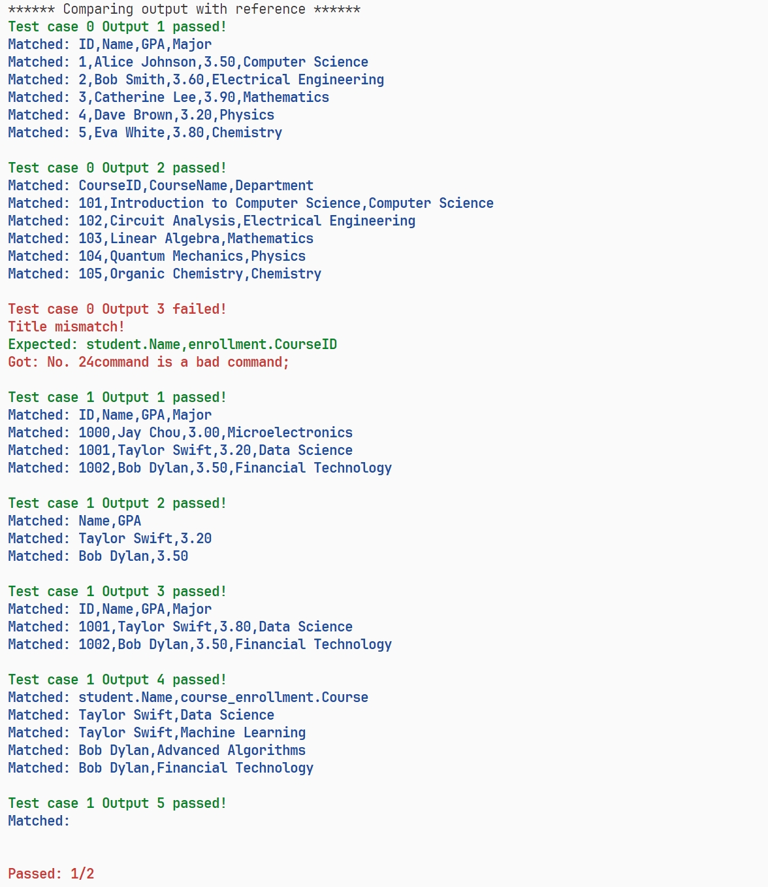

# Fall2024Project

## Introduction

AutoTest is a program that automatically tests the minidb program. It will run the minidb program with a series of test cases and compare the output with the expected output.



## Usage

### Windows

1. compile the AutoTest program and get an executable binary file *windows.exe*
```bash
g++ windows.cpp -o windows
```

2. run *windows.exe* with your minidb executable binary file
```bash
windows.exe C:\UFUG2601Project\minidb.exe
```

### Unix

1. compile the AutoTest program and get an executable binary file *unix*

```bash
g++ unix.cpp -o unix
```

2. run *unix* with your minidb executable binary file
```bash
./unix /mnt/UFUG2601Project/build/minidb
```
