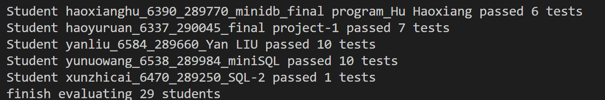

## Introduction
run.py is a script to run all the submissions, which works as follows:
1. unzip all the .zip files in the submissions folder.
1. create a **hw-src** folder, and create a subfolder for each student.
1. copy all the .c, .cpp, .h and .hpp files to the **hw-src** folder.
1. copy the **makefile** and **unix** file to each subfolder in **hw-src**. (unix is the
binary file of the AutoTest program)
1. run the **make** command for each subfolder in **hw-src**.
1. run the **./unix ./minidb** for each subfolder in **hw-src**.

## Usage
1. download the submissions from canvas, and unzip it using
```bash
unzip submissions.zip -d submissions
```
2. run
```bash
python run.py
```
3. check the **result.txt** file in the **hw-src** folder. Note that some submissions may
not be able to compile (Maybe they use Windows headers), so there are no **minidb** and **result.txt** files in the corresponding subfolders.

### Output
The output is like:
